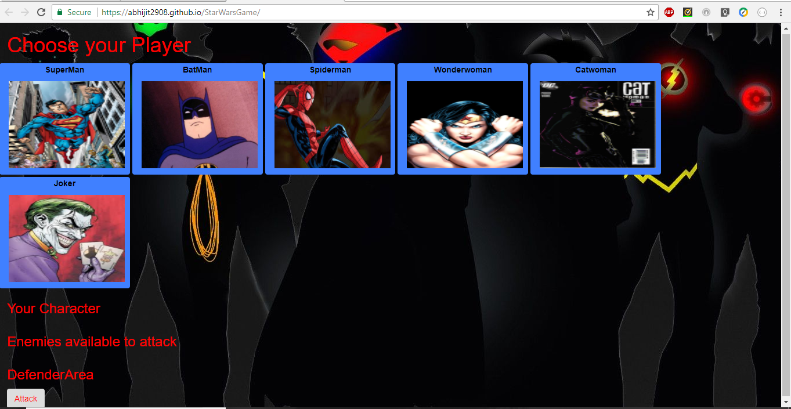
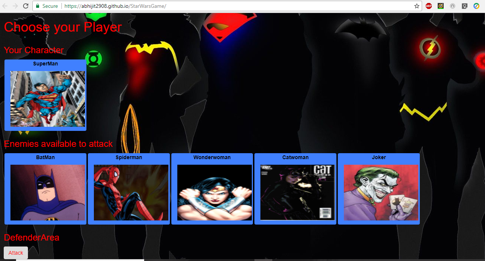
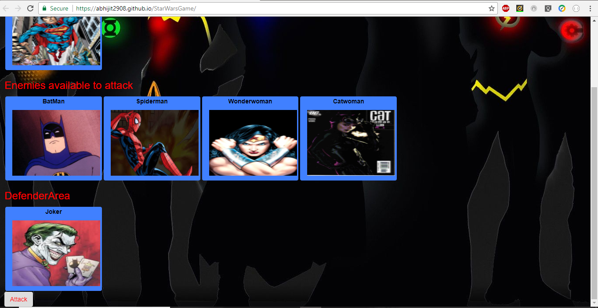
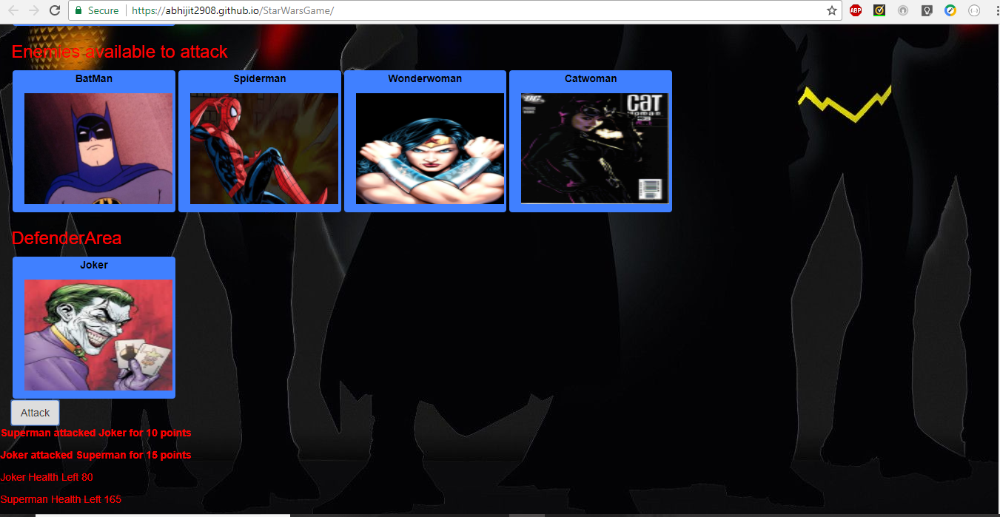
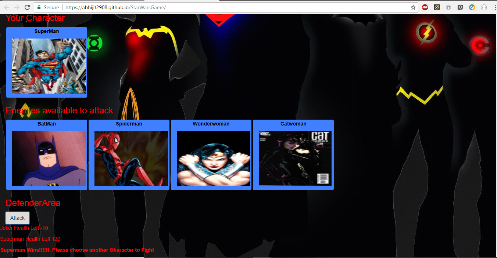
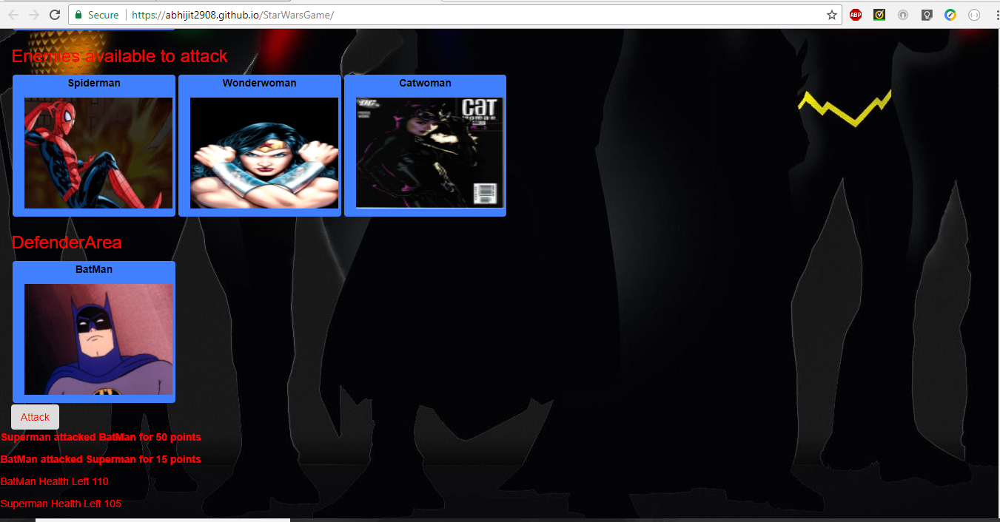
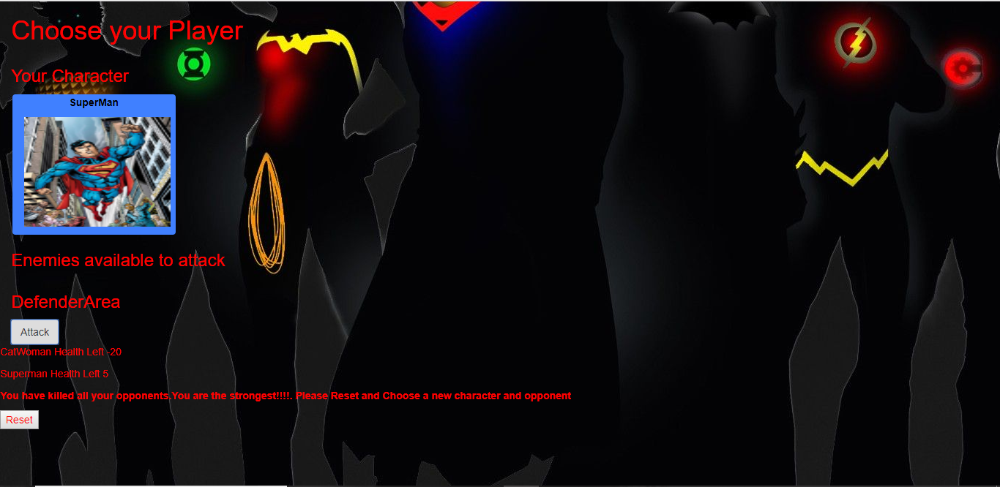
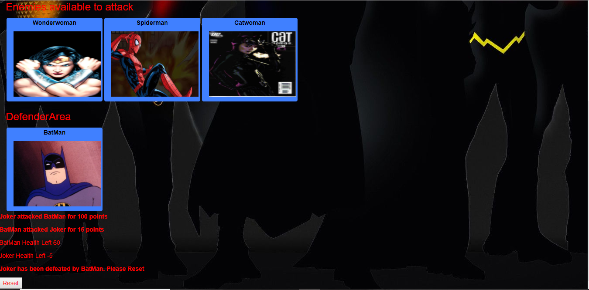

# Superhero Game

Superhero Game is a jQuery based frontend application.

The game is hosted at following link: https://abhijit2908.github.io/StarWarsGame/

Following are the steps how you can play the game:

* When the game starts, the player will choose a character by clicking on the fighter's picture.

* The player will fight as that character for the rest of the game.
  The player must then defeat all of the remaining fighters. Enemies should be moved to a different area of the screen.
  The player chooses an opponent by clicking on an enemy's picture.
  Once the player selects an opponent, that enemy is moved to a defender area.

* The player will now be able to click the attack button.

* Whenever the player clicks attack, their character damages the defender. The opponent will lose HP (health points). These points are displayed at the bottom of the defender's picture.
The opponent character will instantly counter the attack. When that happens, the player's character will lose some of their HP. These points are shown at the bottom of the player character's picture.

* The player will keep hitting the attack button in an effort to defeat their opponent.
When the defender's HP is reduced to zero or below, remove the enemy from the defender area. The player character can now choose a new opponent.

* The player wins the game by defeating all enemy characters. 

* The player loses the game the game if their character's HP falls to zero or below.

